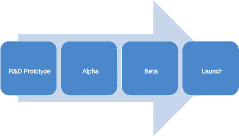

Software Development Process
============================

R&D Prototype Software
----------------------

###Purpose

   - Support hardware validation
   - Consider limitations of software platform
   - Support technical risk assessment
   - Determine resource commitment/requirements for start of production development
   - Start user experience development

####Inputs

   - Product requirements / functional mandate
   - Established and responsive lines of communication with:
   - Early adopters (initial customers / beta sites)
   - Product developers (internal stakeholders)
   - Domain Experts (applications)
####Outputs

   - Minimal software that allows for hardware development (nearly) independent of software resources
   - Identification of platform(s) best suited to use to run software
   - All documentation and materials (SDK, DLL, etc.) necessary for production the software development process
   - Start of documentation of software systems architecture
   - User (customer) profiles and use cases
   - First iteration of GUI mockups
   - The R&D prototype phase will not be considered complete until all the items are completed

###R&D GUI Development

Alpha Release
-------------

   - First commercially viable release of software
   - “Functionally Complete”
   - Has an implementation of all features of final product
   - Has had only minimal testing
   - Does not handle all possible error cases / states
   - May have incomplete cosmetic elements and placeholder text/graphics
   - Ideal for friendly, accessible sites as the most efficient alpha release will result in lots of debugging

Beta Release
------------

   - Near official release, a candidate for an official release
   - “Finishing touches” type fixes
   - Ideal for friendly sites that are eager for an early version and are willing to accept
     workarounds for bugs that they encounter

Launch
------

   - Has all open issues either fixed or addressed via workaround
   - Prepared to support once the software goes live with new customers
   - Begin collection of error reports and features for next release
   - Packaged and ready for service to be able to install / upgrade to early alpha/beta sites